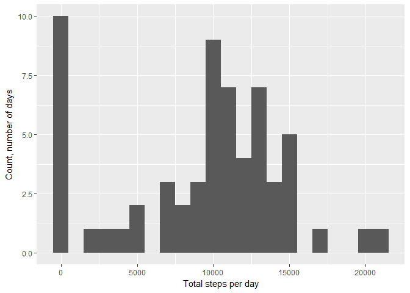
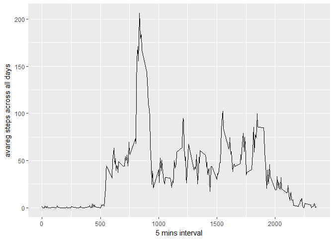
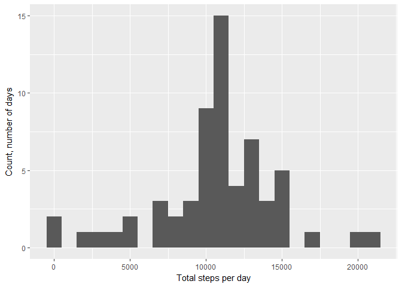
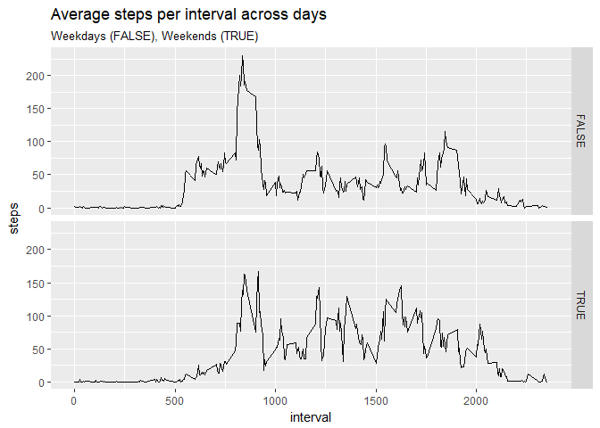

# Reproducible Research: Project 1
Eugene S.  
November 5, 2017  


## Loading and preprocessing the data
put the activity.csv file to working directory


```r
file <- list.files(getwd()
                   , pattern = "activity.csv$"
                   , full.names = T)
actvty <- read.csv(file
                   , sep=","
                   , na.strings = "NA"
                   , stringsAsFactors = F)
```


## What is mean total number of steps taken per day?

```r
ttlSteps <- aggregate(steps ~ date, actvty, mean)
```

here is histogram of total numbers of step per day

```r
library(ggplot2)
ttlSteps_sum <- tapply(actvty$steps, actvty$date, sum, na.rm=T)

qplot(ttlSteps_sum
      , binwidth = 1000
      , xlab = "Total steps per day"
      , ylab = "Count, number of days" 
          )
```

<!-- -->


```r
mean(ttlSteps_sum)
```

```
## [1] 9354.23
```

```r
median(ttlSteps_sum)
```

```
## [1] 10395
```


## What is the average daily activity pattern?


```r
ttlSteps_avg <- aggregate(list(steps = actvty$steps)
                       , list(interval = actvty$interval)
                       , mean
                       , na.rm=T
                       )

ggplot(data = ttlSteps_avg
       , aes(x = interval
             , y = steps)
        )+
        geom_line()+
        xlab("5 mins interval")+
        ylab("avareg steps across all days")
```

<!-- -->


```r
maxstps <- subset(ttlSteps_avg$interval
       , ttlSteps_avg$steps == max(ttlSteps_avg$steps))
message("Interval number with max number of steps:\n"
        , maxstps)
```

```
## Interval number with max number of steps:
## 835
```
## Imputing missing values

Calculate and report the total number of missing values in the dataset 

```r
sum(is.na(actvty$steps))
```

```
## [1] 2304
```

NAs imputing based on steps' average per interval

```r
library(dplyr)
```

```
## 
## Attaching package: 'dplyr'
```

```
## The following objects are masked from 'package:stats':
## 
##     filter, lag
```

```
## The following objects are masked from 'package:base':
## 
##     intersect, setdiff, setequal, union
```

```r
impute <- function(steps.val, interval){
    if(is.na(steps.val))
        nonas.steps <- subset(ttlSteps_avg$steps
                              , ttlSteps_avg$interval ==
                                  interval)
    else nonas.steps <- steps.val
    return(nonas.steps)
        
}

nonas.actvty <- mapply(impute, actvty$steps, actvty$interval)
actvty.new <- mutate(actvty, steps = round(nonas.actvty, 0))
```
new data set summary shows absence of NAs

```r
summary(actvty.new)
```

```
##      steps            date              interval     
##  Min.   :  0.00   Length:17568       Min.   :   0.0  
##  1st Qu.:  0.00   Class :character   1st Qu.: 588.8  
##  Median :  0.00   Mode  :character   Median :1177.5  
##  Mean   : 37.38                      Mean   :1177.5  
##  3rd Qu.: 27.00                      3rd Qu.:1766.2  
##  Max.   :806.00                      Max.   :2355.0
```

```r
sum(is.na(actvty.new$steps))
```

```
## [1] 0
```
Histogram of total steps per day for new dataset

```r
library(ggplot2)
ttlSteps_sum.new <- tapply(actvty.new$steps, actvty.new$date, sum, na.rm=T)

qplot(ttlSteps_sum.new
      , binwidth = 1000
      , xlab = "Total steps per day"
      , ylab = "Count, number of days" 
)
```

<!-- -->


```r
mean(ttlSteps_sum.new)
```

```
## [1] 10765.64
```

```r
median(ttlSteps_sum.new)
```

```
## [1] 10762
```

Imputed data moves avarege and median of total steps per day closer to midday, which is actually more likly describes humans' behavior. 
But anyway the calculation based on some assuption.

## Are there differences in activity patterns between weekdays and weekends?

Create new variable which idicates if date in dataset is weekend day or not

```r
weekend.true <- weekdays(as.POSIXct(actvty.new$date)) %in% 
                c("Saturday","Sunday")
actvty.new <- mutate(actvty.new,weekend.true)
summary(actvty.new)
```

```
##      steps            date              interval      weekend.true   
##  Min.   :  0.00   Length:17568       Min.   :   0.0   Mode :logical  
##  1st Qu.:  0.00   Class :character   1st Qu.: 588.8   FALSE:12960    
##  Median :  0.00   Mode  :character   Median :1177.5   TRUE :4608     
##  Mean   : 37.38                      Mean   :1177.5                  
##  3rd Qu.: 27.00                      3rd Qu.:1766.2                  
##  Max.   :806.00                      Max.   :2355.0
```

Calculate average steps per interval across all days.
Weekends apart from weekdays.

```r
actvty.new.avg <- aggregate(steps ~ interval + weekend.true
                            , actvty.new
                            , mean)
```
Plot 

```r
ggplot(actvty.new.avg
       , aes(x=interval, y=steps))+
    geom_line()+
    facet_grid(weekend.true~.)+
    ggtitle("Average steps per interval across days"
            , subtitle = "Weekdays (FALSE), Weekends (TRUE)")
```

<!-- -->
